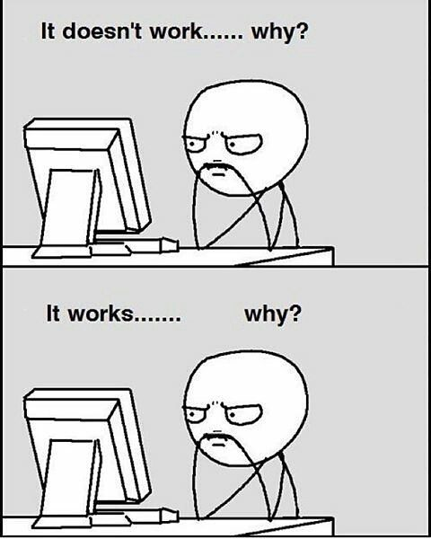

## Techfolios

Computer Science was a major I picked out of the blue, it was something I had no background experience in before the past year. I would see some of my friends pick up everything at an O(1) pace, while it would take me O(n) to understand even the most basic material. Which, is why I decided to take up a project class in revamping Techfolios. With the knowledge I obtain from the experience, I'd like to become more comfortable with using different frameworks and languages to prepare me for taking ICS 314 in my next semester. 

Now, since the beginning of the Techfolio project, the biggest struggle I had was understanding the technical jargon involved. Even then, googling didn't quite give me the answers I expected. I'd understand what certain things were after reading a definition, but I'd miss a connection to what the purpose was. I was missing the experience.

As a beginner, here are some of the questions I asked myself and some of the things I've been preoccupied with while updating my Techfolio...



## What is a JSON file? What's it used for?

A simple google search of JSON would give a result such as: "JSON, or JavaScript Object Notation, is a minimal, readable format for structuring data. It is used primarily to transmit data between a server and web application, as an alternative to XML. Squarespace uses JSON to store and organize site content created with the CMS." 

But I found a better answer from googling a bit more: https://www.copterlabs.com/json-what-it-is-how-it-works-how-to-use-it/ , even then, I didn't know really know how it was incorporated into this project, but replacing information on the given template works because of everything else already implemented.

It didn't take long at all to understand how to create Techfolio from that point on, but without the quickstart video, and only looking at the written guide, it would have taken me much longer to understand how to do so. 

## [USERNAME/USERNAME.github.io] Page build failure -- What did I do now?

When I deleted the last section under "work" from the given template that had two sections, I deleted a "]," while there was a "}," and "]" closing brackets. It didn't take me long to find this error, but my resume also did not update properly because of that error, and I received the nice little email from GitHub with the following message:

```
The page build failed for the `master` branch with the following error:

There was a YAML syntax error on line 88 column 11 in `_data/bio.json`: `did not find expected ',' or ']' while parsing a flow sequence`. For more information, see https://help.github.com/articles/page-build-failed-invalid-yaml-in-data-file/.

For information on troubleshooting Jekyll see:

  https://help.github.com/articles/troubleshooting-jekyll-builds

If you have any questions you can contact us by replying to this email.

```

## I almost kept the entire section for twitter and instagram... Even though I didn't need it

Even though I didn't have a twitter, and was unsure of my instagram account, I originally kept the twitter and instagram sections on my JSON file, and changed the code to:
```
{
        "network": "twitter",
        "username": "",
        "url": ""
      },

{
        "network": "instagram",
        "username": "",
        "url": ""
      },
      
```
 Instead of taking the entire thing out, I left it blank, which might have been okay, but wasn't visually appealing and might even be misleading in the long run, especially since it redirected users that clicked on the link to the original page. The only reason I even noticed I could remove it was because I looked at a finished techfolio of a friend of mine, and noticed that they didn't have all the social media icons on their resume. I didn't know what I could do, and what I couldn't, so I really had to look at other user's profiles.

## The Templates were my savior

Even in the middle of composing this essay from a previous template, I figured that I could use html from that template, making it easier to resize my images without actually altering them in paint.

What it was:
```


```

What I ended up changing it into:
```


```
But, when I tried to replace "ui medium left floated image" with "ui centered medium floated image" , nothing really changed... which leaves me to say...

## Pain Points - the most painful parts of the experience

1. Continuously trying to upload a file onto GitHub without it working
2. The time it took a commit to update the page (refreshing the techfolios page to see if it what I typed had broke it or not)
3. Altering the image sizes

## Conclusion

Overall, the experience was time consuming, but relatively simple to understand.


