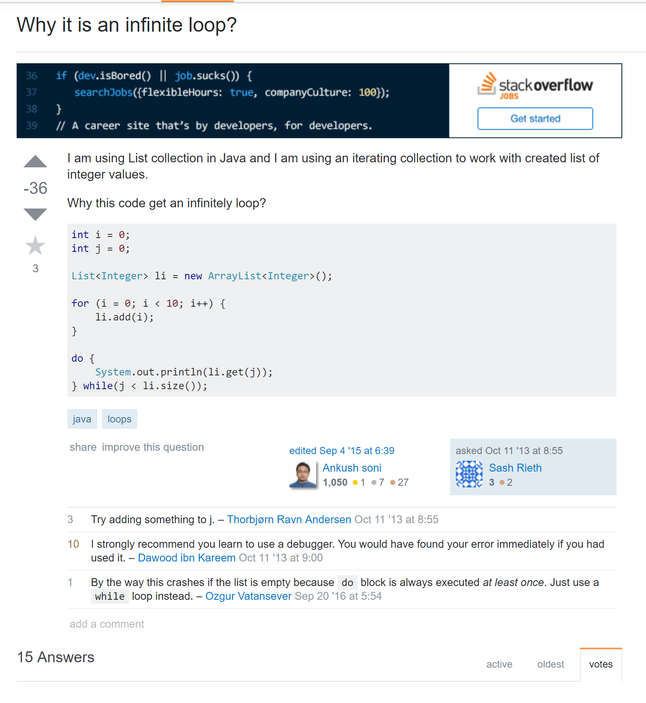
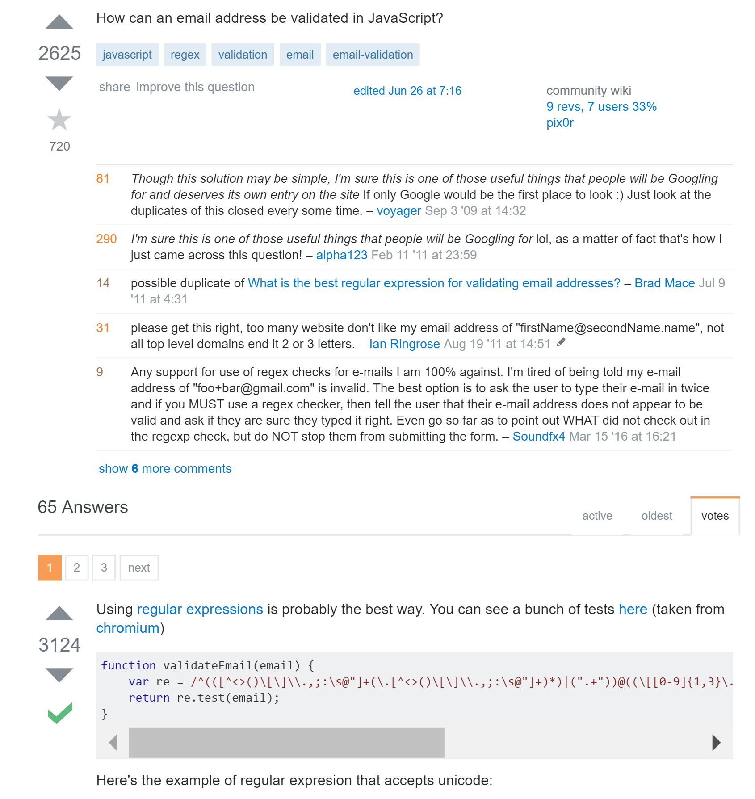

## Essay Background

This technical essay is written in response of Eric S. Raymond and Rick Moen's passage, titled <b>"How To Ask Questions The Smart Way"</b>.

## Why asking questions in a "smart way" is important for software engineers, and knowing when to ask
<h6>He who asks a question is a fool for five minutes; he who does not ask a question remains a fool forever.<a href="https://www.forbes.com/sites/mikemaddock/2013/07/09/the-best-question-to-ask-people-who-are-really-smart-so-you-can-learn-from-them/#32dbaa503513"> - Chinese Proverb, Mike Maddock</a> </h6>

Take for an example, an inquiry is proposed in such a way as "App isn't working on phone". This is what would be called a "bad" question, for several reasons. The question never specifies what application it is referring to, not to mention what type of phone nor the version of the software. Because this question is so ambiguous, it is unlikely that users would want to reply. 

A better way instead to ask the question would be "MyFitnessPal application iOS 10.3.3 - unable to start", whoever would answer the question would understand which version and the application type, so before people tap on the question and see if they can answer it, they'll know which version, which application, so it wouldn't waste anyone's time as well.

The reason I mentioned these questions, is because it is more likely to receive a better answer when including more specifications into a question. There are also some ways a question can be asked that would result in unhelpful responses. In the first case, for instance, if the app and version types were not specified, then there is no telling if the question will be answered properly. Waiting for an answer for a few minutes up until a week only to receive an answer that is not applicable to the situation would only be a waste of time as well.

In another case, when asking on stack overflow, too specific questions will be marked **closed** and determined as being too specific to be any use to the general public, so questions asked might not even be answered. Questions such as those might be unrelated to post on stack overflow to start with, and might be better to ask the product's distributors. This is why there is value in knowing when to ask, rather than wasting O(n^2) time when waiting for a reply, it is imperative that users first figure when it is relevant, as Raymond and Moen had stated, and why a smart question that is also asked in context might decrease the time it requires to respond. 

## Now to review: Poorly asked questions vs. Smart Questions

The criteria before asking good questions, by  <a href = "http://www.catb.org/esr/faqs/smart-questions.html"> -Eric S. Raymond and Rick Moen:</a>

1.	Try to find an answer by searching the archives of the forum or mailing list you plan to post to.
2.	Try to find an answer by searching the Web.
3.	Try to find an answer by reading the manual.
4.	Try to find an answer by reading a FAQ.
5.	Try to find an answer by inspection or experimentation.
6.	Try to find an answer by asking a skilled friend.
7.	If you're a programmer, try to find an answer by reading the source code.
8.  Describe the symptoms of your problem or bug carefully and clearly.
9.  Describe the environment in which it occurs (machine, OS, application, whatever). Provide your vendor's distribution and release level (e.g.: “Fedora Core 7”, “Slackware 9.1”, etc.).
10.  Describe the research you did to try and understand the problem before you asked the question.
11.  Describe the diagnostic steps you took to try and pin down the problem yourself before you asked the question.
12.  Describe any possibly relevant recent changes in your computer or software configuration.
13.  If at all possible, provide a way to reproduce the problem in a controlled environment.

From those criterias, I have located the following:

<h2>Poorly Asked Questions</h2>
1.

2.

3.

<h2>Smart Questions</h2>
1.

2.

3.

