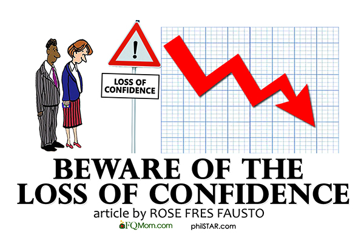

This essay is targeted towards addressing the questions on coding standards from the following link: 

http://courses.ics.hawaii.edu/ics314f17/morea/coding-standards/experience-coding-standards-technical-essay.html

## First, to adress the BIGGEST issue ...

The question asked from the link "I believe some coding standards can actually help you learn a programming language. Do you agree?"

Based on my experience, reading poorly formatted code from the beginning has made learning the language more difficult. Issues arose from missing curly braces or the braces ending before or after the right place in the code, causing semantic errors. Oftentimes when I encountered these issues, as a beginner, I attributed the errors as an error in logic, and began to try every which way to fix it, mainly through brute force, taking much longer than necessary in completing the problem.

But I believe that the biggest issue with semantic errors such as those, wouldn't be losing **n**-many hours in the process, the biggest issue might well be the loss in confidence in pursuing a career in programming. Believing that you are wrong, that you will be wrong, and finding something like programming meaningless. If that is the case, there would be no progress whatsoever, even if the issue was eventually solved, it would have effectively done more damage than losing an hour of work.

So that is, to answer the question, I do certainly agree that some coding standards can help with learning a programming language. At the bare minimum, the standard will aid in organizing code. Easier to read and more organized code certainly makes it easier to navigate and make alterations to the code in case syntax or semantic errors arise.

## Small Qualms

Addressing the question:  After your first week of using ESLint with IntelliJ, what are your impressions? Are you finding that getting the green checkmark is painful, or useful, or both, or something else entirely?

I frankly quite enjoy using IntelliJ, although it could be more or less confusing at times (especially with changing preferences on a Windows OS when given the MAC OS run down). But even though I do like using the IntelliJ IDEA... The green checkmark in ESLint is not really on my list of favorites. Although I would understand where the green checkmark would be useful, but there were certain cases such as the following lines of code:

function ziplist(list1, list2)
{
    var local = [];

    for (var i = 0; i < (list1.length + list2.length)/2; i++)
    {
        if(list1[i]!==undefined){
            local.push(list1[i]);
        }
        if(list2[i]!==undefined){
            local.push(list2[i]);
        }
    }
    return local;
}

The issue was that the order of list2[i]!==undefined should have been swapped with list1[i]!==undefined, which gave weak warnings, but nonetheless prevented the green checkmark. Although, I do find the suggestions useful for the most part to keep a consistency in the coding style.

##Side Note

Although it is not an issue with obtaining the *green checkmark* in IntelliJ, but while programming ziplist for a previous assignment, I did not make use of camelCasing, as I assumed ziplist to be the entire word. Doing so just caused a spelling error. The same issue occurred with using a URL in the html file for .  For more information, on the ziplist program, <a href = "https://github.com/alicewy/ziplist"> click here </a>

**Camel casing, defined with visual aid**

