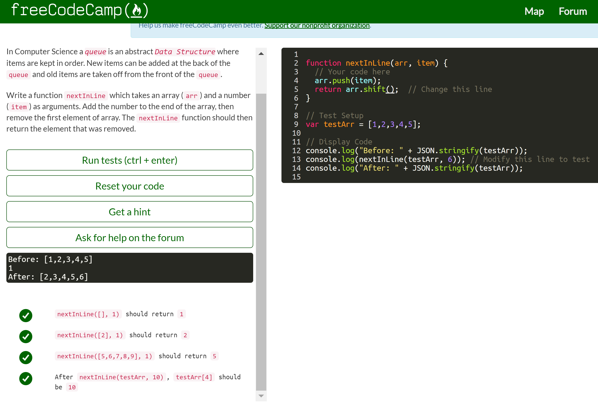
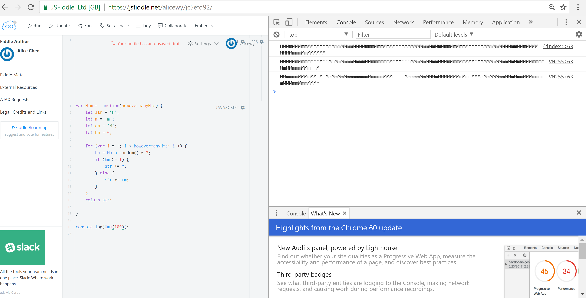

This essay is a reflection on the following ICS 314 Module on JavaScript: 

<a href = "http://courses.ics.hawaii.edu/ics314f17/modules/javascript-1/">The link to the 314 Module</a>

## JavaScript, Freecodecamp, and Me

I never learned the JavaScript language prior to this class, I did learn beforehand that JavaScript could be used for backend programming; that is, if I were to use node.js. The JavaScript experience through the freecodecamp.com tutorial, however, I found very easy and intuitive. The most problem I had with the tutorial was only overthinking the problem. I can only remember one instance of really being stuck, and it was because of a bad habit of mine in reinventing the wheel. It was a problem that was very simple and only required two lines of code, that I spent time trying to write a dozen or so lines to solve.

**<small>
 The problem I was stuck on, with the answer included 
</small>**

However, aside from that small problem, I found the current module easy as I only really needed to learn the syntax of JavaScript for front end development. Compared C/C++, it was a far easier to comprehend, and didn't require the knowledge of any pointers. I JavaScript easier than Java as well, and was surprised that their datatypes weren't explicitly defined.

## JavaScript and Workout Of the Days (WODs)

The degree of difficulty did ramp up in comparison to the freecodecamp tutorials, but the self-practice WODs were still manageable. In the two assignments we were given from Project Euler, because I didn't know about Chrome Developer Tools, I had issues with using console.log that would not print to the console in JSFiddle. Thus, for my first two practices on the first projectEuler mod <a href = "https://jsfiddle.net/alicewy/96m0u074/"> (Here is a link to the JSFiddle of my *first* completed WOD) </a> , I received times of "DNF" which exceeded 8 minutes, and it took my third try to complete it within a time of 4-5 minutes. My second WOD took even longer, I misinterpreted the question in the beginning, so it took me around 30 minutes or so (needless to say I did not finish) on my first two attempts. But, on my third attempt I completed it in 11 minutes with a break in between due to lag, and on my fourth attempt I took 5 minutes <a href = "https://jsfiddle.net/alicewy/usc8y7ga/"> (Here is a link to the JSFiddle of my second completed WOD) </a>.

## Module (and WOD) Pros

- A valuable experience in programming under pressure (WOD) 
- Learning one of the most used language, if not the top most used
- Taking a step into creating a presence on a Professional Network

## Module (and WOD) Cons

- Personal practice WODs were assigned before in-class practice WODs (I began reading instructions and included it as part of the time) 
- In-class WODs are too easy
- Possibility of lag, screen freezing, or internet connection issues during a WOD causing a DNF (Connect issue happened to me once, luckily I finished)
- A stressful experience in completing a WOD with 100% accuracy and with a fast time
- One missing comma with JSON files, and page build errors won't stop

## My Verdict

Even if the cons listed are greater in quantity than the pros, the JavaScript module was overall a really good experience to me.
I was able to learn the syntax of a widely used new programming language, and all the assignments forced me to develop better habits to keep up with the course. Sometimes here and there, I also end up on codefights.com or creating a JSFiddle just for trivial things to practice my skills.

For instance, when I wanted to randomly disperse lower and uppercase Ms (the letter) to say "Hm" in an interesting way, to emphasize that I was thinking to my friend, but could not help but create a pattern when I physically typed it myself.
Thus, the creation of the "Hmm" function, was born.

**<small>
 The "Hmm" function in action (displayed in console on right having ran three times) 
</small>**

## The End

