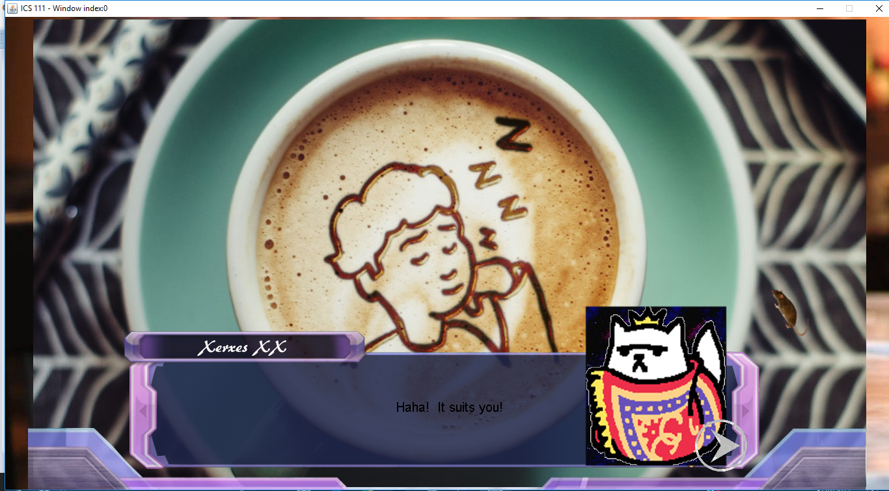

<b> What's this now? </b>

Purrsuasion is a cat dating simulator developed by me, Logan Uyeda, and Jaystin Garcia for our final project in our ICS 111 class, Introduction to Computer Science. In the game, the player has the choice of dating three cat characters from the Neko Atsume Franchise. The first cat that the player has the option of selecting is Xerxes, after pursuing and conquering Xerxes, do the other two cat's routes unlock. Upon running the game, before the game begins and loads, the player is serenaded by the saxophone instrumental version of Careless Whisper.


<b> So, somehow I became the team leader? </b>

I looked to the seat to my left, and then to the right, and immediately decided the two people sitting besides me were my teammates. In the meantime, I also came up with Purrsuasion when I remembered a game I used to play, Neko Atsume, and my friend telling me about a dating sim game. So, born from all the silliness, was Purrsuasion. We split the work in this manner - I created the scenario for most of the scenes and wrote Java code to transition between them using a switch statement, my partner, Logan, created a few functions to make the dialogue transition smoothly from a text file, and our last teammate, Jaystin, helped mainly with the design aspect and dialogue between the player and the cats. 

Some dialogue from the game includes:

```
Xerxes: Hm? What brings you here?  Did you purrhaps want to date me? You've got to be kitten me!  I'm not that easy! At least talk to me first!

Character selection choices:
 
 • You are so purrrty
 • You smell like kitty litter
 • How is your day going so far?
 
 
 
Xerxes: It's a bit chilly don't you think?
 
Character selection choices:
 
 • You look like you're comfortable
 • Definitely. The weather's really bipolar.
 • I like the color of your fur.
 
```
Depending on the player's selection, Xerxes' affection either raises, or decreases, and when it is high enough, the player is prompted to go on a date, with the option of two different dating locations.

A scene from the game:




<b> What I learned, and the most difficult part </b>

With everyone's different schedules and hardly being able to meet up, and for how little I knew how to program in a good style as a freshmen in my first semester of ever learning Computer Science, I ended up writing about 500 or so lines of code, when there were much easier methods that would significantly reduce the lines written. At least, from this experience, I knew I had to ask someone for help when I needed it in the future, and the value of organization, setting team meetings, and commiting to it.
