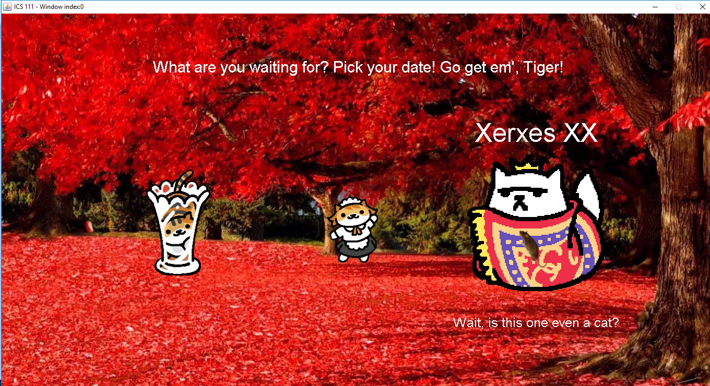

Purrsuasion is a cat dating simulator developed by me, Logan Uyeda, and Jaystin Garcia for our final project in our ICS 111 class, Introduction to Computer Science. In the game, the player has the choice of dating three cat characters from the Neko Atsume Franchise. The first cat that the player has the option of selecting is Xerxes, after pursuing and conquering Xerxes, do the other two cat's routes unlock. 

