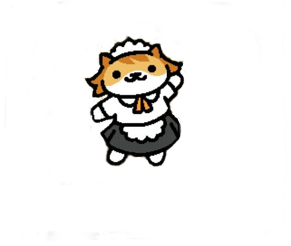

  
  
  

Purrsuasion is a cat dating simulator developed by me, Logan Uyeda, and Jaystin Garcia for our final project in our ICS 111 class, Introduction to Computer Science. In the game, the player had the choice of dating three cat characters from 

