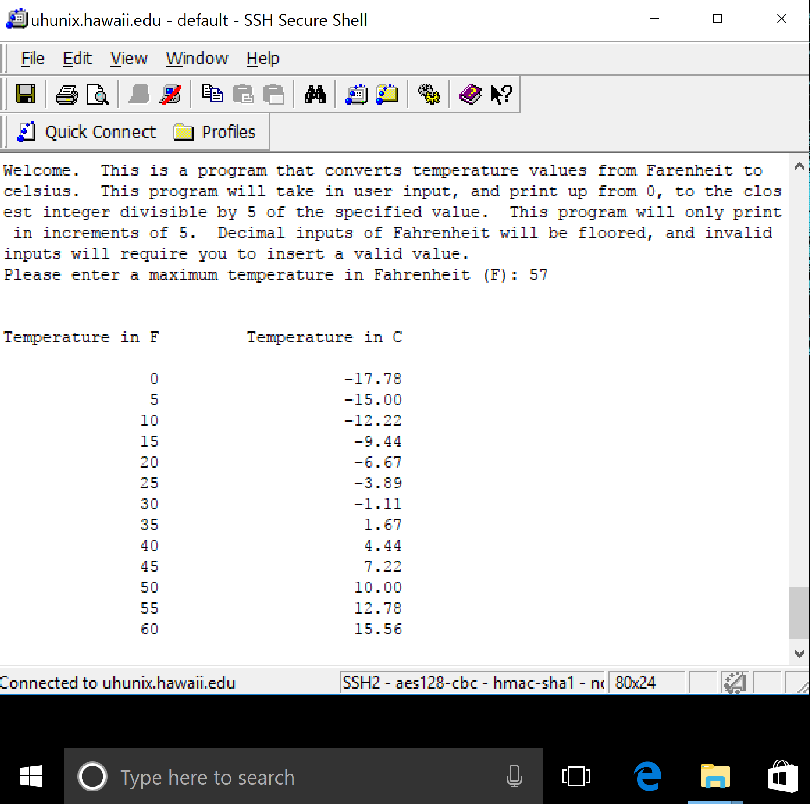

This temperature converter program uses both Java and C to create an interface that requests the user to enter an input in Fahrenheit.

<a href="https://github.com/alicewy/ICS212/tree/master/hw9">This is the link to my project!</a>
