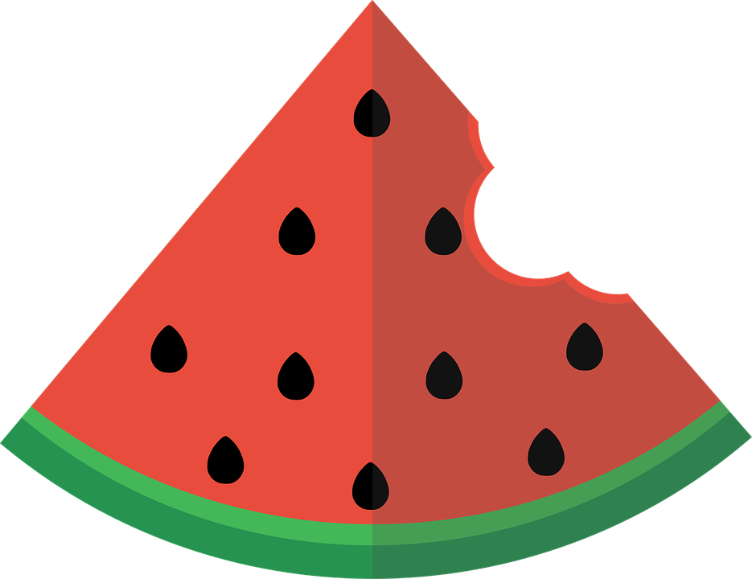

 ---
  layout: project
  type: project
 -image: images/fridgeeLogo.png
 -title: Fridgee
 -permalink: projects/fridgee
 +image: images/LearningAssistanceCenter.png
 +title: Tutoring at the Learning Assistance Center
 +permalink: projects/LearningAssistanceCenter
  date: 2017
  labels:
    
 -  - AndroidStudio
 -  - mySQL
 -  - php
 +  -
    
  summary: My team developed a food recommendation application for the 2017 NASA hackathon Space Apps Challenge.
  ---
  
 -
 -
 -Fridgee is a food recommendation application that was created for the 2017 NASA Space Apps Challenge under the category "What's for Dinner?"
 -The app takes in user input of the contents in a fridge in order to recommend recipes for foodstuffs closing to their expiration date, to tackle the issue of excess waste.
 -The application recommends recipes if there is at least a 70% match of ingredients, and also offers a list of food preservation tips.
 -
 -You can learn more about the category the app targeted at [NASA SpaceApps](https://2017.spaceappschallenge.org/challenges/earth-and-us/whats-dinner/details).
 -
 -
