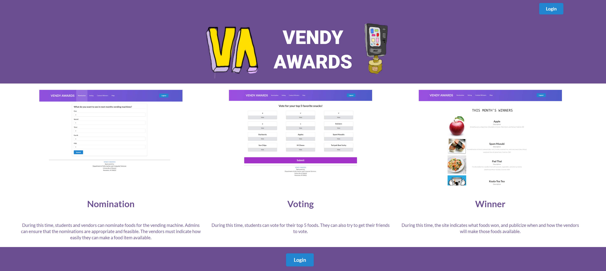

<small>The landing page for VendyAwards</small>

<b>The success</b>

Learning how to use an API for the first time was definitely new, luckily the Google Maps API was fairly user-friendly, and issues that resulted
in failure lay in simple syntax errors in the beginning. Although testing the different codes given from the API took a lot of time, the experience
was quite enjoyable. For the map, I was able to obtain the user's location using the Google Maps API for Geolocation and mark that point with a marker. 
I was also able to create markers to populate the map with the locations of the vending machine, and adding markers would be simple as to populate the
array with the information. All that was left was to find the latitude and longitude of the Vending Machines' positions on the UH Campus, and 
enter those values to include on the map. I was also able to include the location's name in a pop-up when the markers were clicked. Although the 
geolocation's main purpose was something entirely different, I had the map centered to the location of the user as well.

<b>The failure</b>

My intial goal was to have the map so that when the user clicks on a marker, directions leading from the user's current location to the markers' location
would appear. However, running low on time and testing given code on directions with waypoints given as a sample from the google maps API, which wasn't
my intention of the map, I ran out of time to create what might have been one of the key features of the map.

<b>The last minute compromise</b>

Since the directions were a no-go, a group-mate asked me: "What do you think could do, that would be a step down from what you wanted to do in the time we have [to enhance the project]?"
Thinking about such good advice, I thought, if it's just a simple map, make it so that when you click on the marker point, the map would zoom in on the position
so that the user can see the streets and the location more accurately, and set the center to the location clicked. That was a functionality that would have been 
useless if directions were implemented, but the question really had me thinking about improving design on a time constraint.

<b>Other fun features</b>

I included a color gradient navigation bar that I though looked nice, and made great use of Chrome developer tools to alter the CSS values when working on
the pages I was tasked to do.

Check out the deployed app for vendyawards at: 
http://vendyawards.meteorapp.com/

And the installation guide here at:
https://vendyawards.github.io/ 

